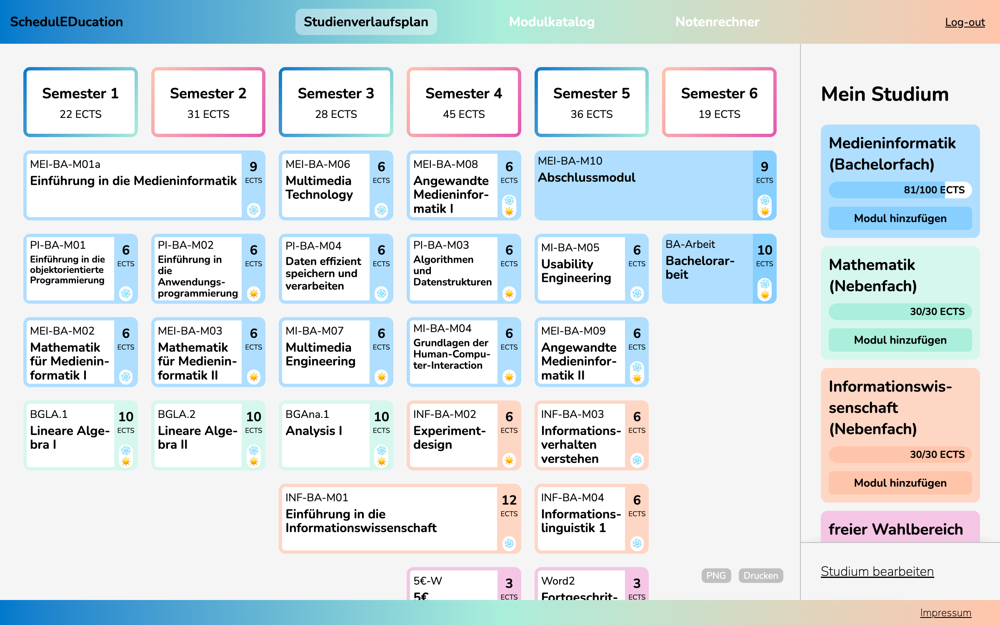
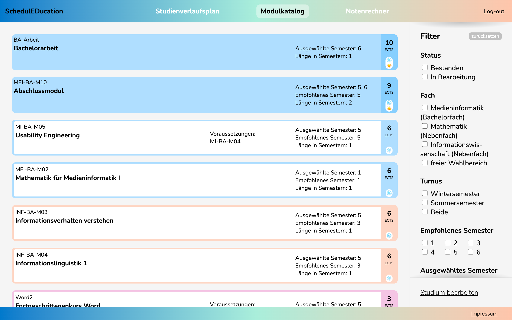
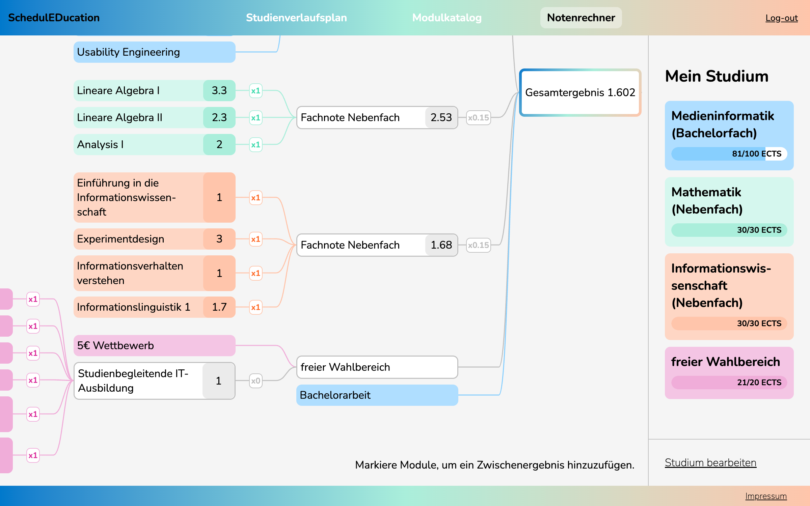

# SchedulEDucation (BA-Arbeit)
Diese App soll beim Planen des Studiums helfen und dabei die wichtigsten Forschritte festhalten. 
  

Probiere es hier gleich aus: https://emmasophiereichert.github.io/BA-Arbeit/app/
  

## Was genau ist SchedulEDucation?

In dieser App kannst du ganau planen, welches Modul du in welchem Semester machen möchtest. Trenne dabei einzelne Studiengänge oder deinen Wahlbereich ab. 

Im Modulkatalog kannst du alle Module und die Daten einsehen und nach bestimmten aspekten Filtern.

Du kannst auch Noten eingeben, und deinen aktuellen Schnitt im Notenrechner berechnen.

